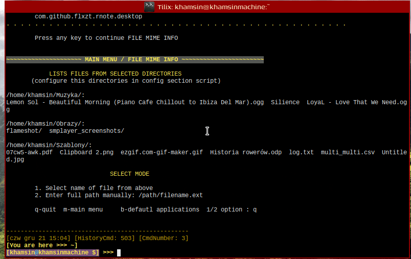

##### MIME MANAGMENT - MIME TOOLS 
The script allows you to perform the following operations related to mime types:
* File info
* Refresh mimeinfo.cache - database cache for desktop file
* Refresh mime directories: */mime
* Set default appplication for mime type
* Edit mimeapps.list for all users - Additional associations / blocked associations
* Edit mimeapps.list for current user - Additional associations / blocked associations
* Create new mime-type, for advanced users
* Install new mime-type for all users
* Install new mime-type for current user
* Uninstall mime-type

##### PRESENTATION


##### DEPENDENCIES
* xdg-utils : v1.1.3+45+g301a1a4-1
* findutils : v4.9.0-3
* glib : v2 2.76.4-1
* gawk : v5.2.2-1
* desktop-file-utils : v0.26-2
* shared-mime-info : v2.2+13+ga2ffb28-1

##### INSTALLATION
Clone repositoty to the selected directory, use the command:
```
git clone https://github.com/bohorok/xdg-mime-tools.git
```
Grant execution permisions for the xdg-mime-tools.sh:
```
chmod 755 xdg-mime-tools.sh
``` 
You copy script xdg-mime-tools.sh to the directory where you store scripts.
Default Places for our scripts are:

* /usr/share/local/bin/
* $HOME/local/bin/

Check key PATH in environment variables for the presence of the above search paths - command:
```
printenv
```
If you want add your path, use the files where you add variables:

* /etc/environment
* $HOME/.profile
* $HOME/.xinitrc

##### CONFIGURATION SECTION SCRIPT
All script configuration options are in the section:
SECTION CONFIG SCRIPT
```
# locations from which the script will show files to examine for their mime type
file_types_in_directories="$HOME/Documents/ $HOME/Download/ $HOME/Picture/ $HOME/Musics/ $HOME/Video/ $HOME/Graphics/"
# locations for searching desktop files for some script functions
searched_desktop_localizations="/usr/share/applications/ /usr/local/share/applications/ $HOME/.local/share/applications/ /opt/"
# Your favourite GUI or terminal editor 
favorite_editor="subl"
# Locations for installation your xml file
find_xml_file="$HOME"
# Colors
head_colors="\033[1;100;93m"
text_color="\033[93m"
end_colors="\033[0m"
```
##### FINAL REMARKS